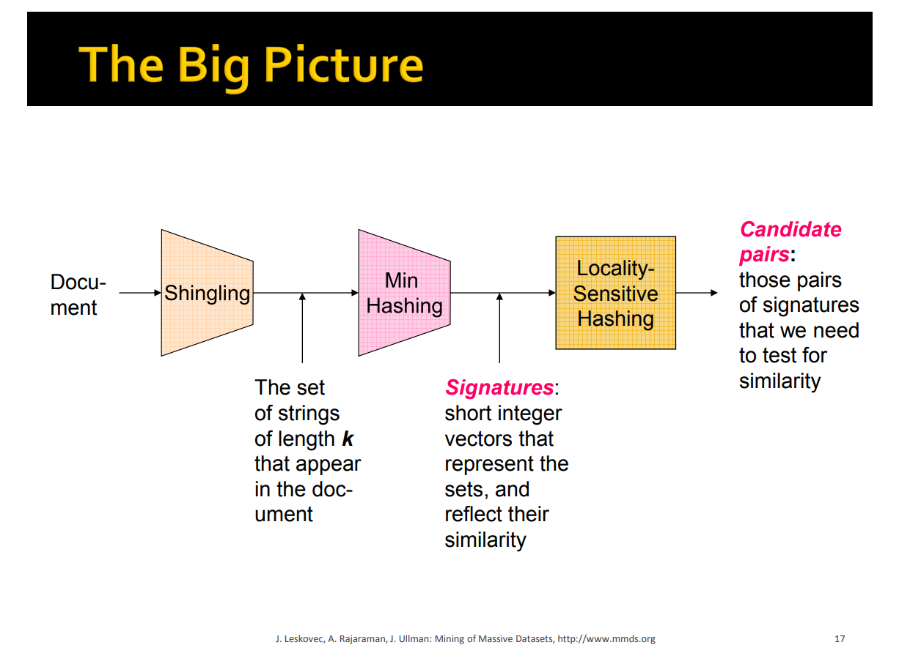

# Implementation of Shingling, MinHash and LSH  

## Process

## Usage
The code requires Python 3.11 and pandas to load the data.
To run with the default test data run `python main.py` from the root directory.
There are command line arguments to change the data source and the number of hash functions used. See main.py for details.

## Next steps  
* To run on a larger dataset. 
* To run in docker
* To run on json data - done
* To add results for different thresholds to the output
* Batch process millions of records keeping the unique ones each time

## Results
Version 1.0
Ants, Z-book:  
### exp 1 base case
* shingling_size: 10  
* signature_size: 50  
* bands_nr: 10  
* threshold: 0.8  
* test data filename: data/rent_rome_text.csv  
-----------------------------------------------------------------  
Dataset loaded in: 0.04 seconds.   
Shingles produced in: 1.83 seconds.  
Signature Matrix computed in: 74.07 seconds.  
LSH Similarity computed in: 0.74 seconds.  
No. Similar : 10297  
memory usage: 7.6+ KB   
Reduction ratio: 92.58%  
done: overall time taken 77.96264934539795  
-----------------------------------------------------------------
### exp 2 use a json
* test data filename: data/rent_rome_text.json  
-----------------------------------------------------------------
Dataset loaded in: 0.03 seconds  
Shingles produced in:    1.85 seconds.  
Signature Matrix computed in:    68.43 seconds.  
LSH Similarity computed in:      0.65 seconds.  
No. Similar : 10297  
memory usage: 7.6+ KB  
Reduction ratio: 92.58%  
done: overall time taken 72.08898615837097  
-----------------------------------------------------------------
### exp 3 remove nested loops  
* refactored `get_candidate_list` to remove nested loops  
 done: overall time taken 70.04273414611816 
* refactored `compute_set_signature` to remove nested loops  
 done: overall time taken 68.06141304969788
* refactored `get_signature_matrix_bands` to remove nested loops  
 done: overall time taken 67.85358190536499  
* refactored `get_similar_items` to remove nested loops  
 done: overall time taken 67.85358190536499
* refactored `get_similar_items` to remove nested loops  
 done: overall time taken 68 and 69 so no improvement returned to orginal

## References
1. [Web Article with code example](https://www.codemotion.com/magazine/backend/fast-document-similarity-in-python-minhashlsh/)
2. [Stanford Chapter 3 lecture](https://www.youtube.com/watch?v=dRWO3il-jjA)
3. [Starter Notebook](https://github.com/nicoDs96/Document-Similarity-using-Python-and-PySpark/blob/master/LSH/DM_HW2_Ex2.ipynb)
4. [MMDS book](http://infolab.stanford.edu/~ullman/mmds/book.pdf)
5. [MMDS slides](http://www.mmds.org/mmds/v2.1/ch03-lsh.pdf)
